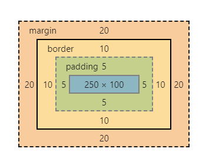
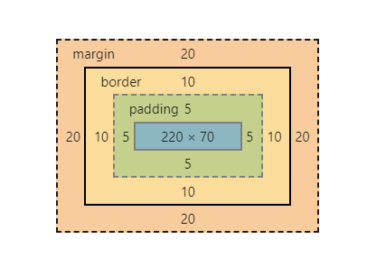

那天和大神谈笑风生，他给我发来了一个截图，内容大概是这样的

> 大神：
>
> - 比如你写了一个 div 宽度 400px
> - 你加了一个 border 和 padding 各 10px 以后
> - 根据 w3c 美丽的盒模型
> - 你的 div 宽度变 440px 了
>
> 我：
>
> - 不对啊明明是 360px
>
> 大神：
>
> - 不不不默认的 content-box
>
> 我的内心：
>
> - 默认的不是 border-box 吗你别骗我

毕竟以前在上网页设计课的时候，拿盒模型出来计算内容区域的大小是我最烦心的事情。在我平时打代码的印象里，盒模型默认用的都是`border-box`，突然跑出来一个`content-box`就让我百思不得其解…

于是我 Google 了一下，**发现特么的默认的还真是`content-box`**

然后我又打开了自己以前写过的页面，仔细追查了一下，发现原来这个原因出现在 bootstrap 中将盒模型默认指定成了`border-box`。

既然都说到这了，那也就顺便说一下`content-box`和`border-box`之间的差别。

### content-box

官方给出的说明是

> 这是 CSS 标准规定的初始值和默认值。 宽度和高度属性，仅包括内容，但不包括填充(padding)，边框(border)或边距(margin)。

也就是说，在 CSS 中定义的宽度和高度属性，是从**padding**和真实的**content**分界处开始计算的。而这个盒子最终宽度和高度应该是

**width(height) + padding(上下或左右之和) + border(上下或左右之和) + margin(上下或左右之和)**

假定我们赋予它这样的属性：

```css
element.style {
  height: 100px;
  width: 250px;
  border: 10px solid #000;
  margin: 20px;
  padding: 5px;
  box-sizing: content-box;
}
```

则它计算后的大小是这样的：


### border-box

官方给出的说明：

> 宽度和高度属性包括内容，填充(padding)和边框(border)，但不包括边距(margin)。

也就是说，我们在 CSS 中定义的宽度和高度属性，是从**border 和 margin 的分界处**开始计算的，那么这个盒子模型的最终宽度或高度应该是

**width(height) + margin(上下或左右之和)**

而内容可以占用的位置为

**wdith(height) - border(上下或左右之和) - padding(上下或左右之和)**

我们现在把刚才那个盒子的模型改为 border-box：

```css
element.style {
  height: 100px;
  width: 250px;
  border: 10px solid #000;
  margin: 20px;
  padding: 5px;
  box-sizing: border-box;
}
```

则计算出的大小为


## 另外

其实`border-box`这个属性值是有一些来历的，有兴趣的可以去百度一下。对比一下这两种属性值，究竟谁好谁坏也并不好下定论，个人比较认可`border-box`，毕竟用起来比较方便一些。关于这个知乎上也有一些讨论，[可以点这里去看看](https://www.zhihu.com/question/20691294)。

当然如果要用`border-box`属性的时候，最好是像 BS 那样将模型全局设定，否则排版的时候容易出现一些问题。

参考文档

- [box-sizing - CSS | MDN](https://developer.mozilla.org/en-US/docs/Web/CSS/box-sizing)
- [CSS3 box-sizing 属性](http://www.w3school.com.cn/cssref/pr_box-sizing.asp)
