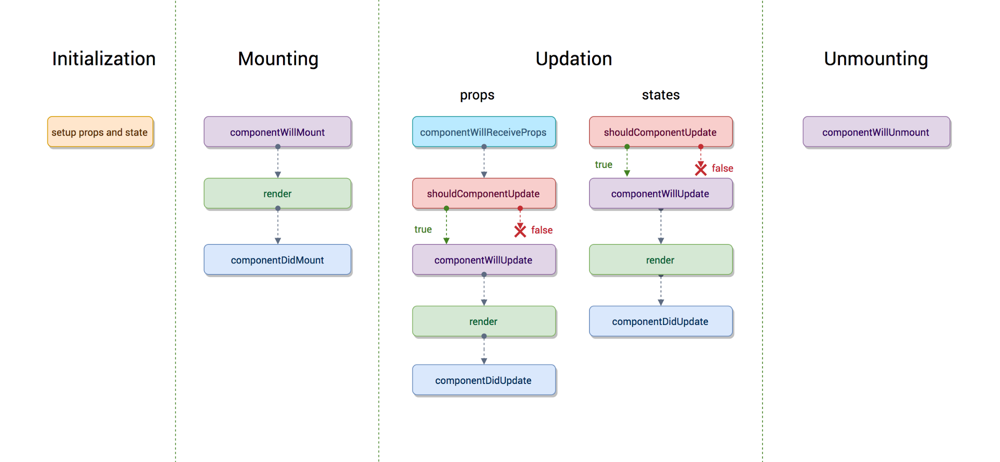
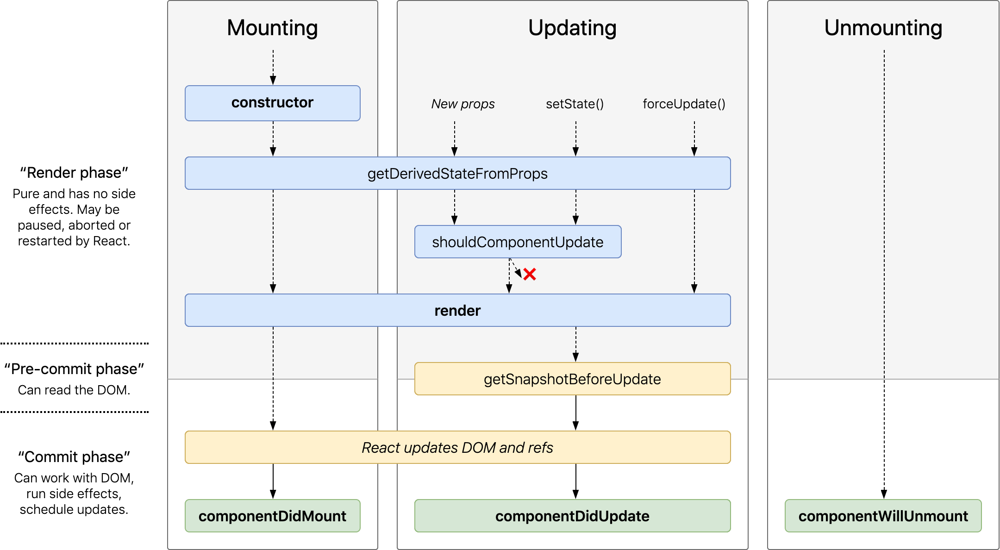

在今年三月底的时候 React 发布了 16.3 版本。这次更新主要有两个内容——新的生命周期函数和 context API（[React v16.3.0: New lifecycles and context API](https://reactjs.org/blog/2018/03/29/react-v-16-3.html)）。

对于生命周期函数，主要有以下改变（[Update on Async Rendering](https://reactjs.org/blog/2018/03/27/update-on-async-rendering.html)）：

- 以下生命周期函数将在以后的版本（17.0）中弃用（加上`UNSAFE_`前缀）：
  - `componentWillMount` 
  - `componentWillReceiveProps` 
  - `componentWillUpdate`
- 添加了两个生命周期函数：
  - `static getDerivedStateFromProps`
  - `getSnapshotBeforeUpdate`

可以通过两张示意图对比一下新旧生命周期函数

旧的 React 生命周期示意图如下


新的 React 生命周期示意图如下（[react-lifecycle-methods-diagram](https://github.com/wojtekmaj/react-lifecycle-methods-diagram/)）:


本文会简单介绍新的生命周期函数、说明旧的生命周期函数可能造成的一些问题以及如何迁移到新的生命周期函数。

## 新的生命周期函数

### `static getDerivedStateFromProps()`

```jsx
static getDerivedStateFromProps(nextProps, prevState)
```

这个函数会在组件被实例化或接收到新的 _props_ 时被调用。函数返回一个对象用于更新 _state_ 以响应 _props_ 变化。 如果返回值为`null` 则表明不改变 _state_ 。

如果函数返回一个对象，这个对象的键将被合并到现有 _state_ 中。

需要注意的是，React 在 _props_ 没有发生更改的情况下也可能调用这个函数。如果计算将要派生出的数据需要消耗很多资源，请将新的 _props_ 和上一个 _props_ （需要人为纪录下来）进行对比，在仅必要的时候进行计算。

也就是说，现在你不再有权在`getDerivedStateFromProps` 函数中获取`this.props`。如果你需要用到`props`中的数据，可以选择将他们保存在`state`中。如果你觉得这么做会导致数据重用，可以参考这篇[文档](https://reactjs.org/docs/state-and-lifecycle.html)。

[官方文档](https://reactjs.org/docs/react-component.html#static-getderivedstatefromprops)

### `getSnapshotBeforeUpdate()`

```js
getSnapshotBeforeUpdate(prevProps, prevState)
```

这个函数会在最新的渲染输出提交给 DOM 前将会立即调用。函数会返回一个 Snapshot 实例。在`componentDidUpdate` 函数中它可以作为第三个参数被调用，以便对 DOM 进行状态更新。

[官方文档](https://doc.react-china.org/docs/react-component.html#getsnapshotbeforeupdate)

## 动机

这次添加新的静态生命周期函数`getDerivedStateFromProps` 并弃用旧的生命周期函数的 _主要原因_ 是旧版组件 API 中的函数存在一些异步渲染的潜在安全缺陷。举几个常见的问题（[Common problems](https://github.com/reactjs/rfcs/blob/master/text/0006-static-lifecycle-methods.md#common-problems)）：

- 在`componentWillMount` 中初始化 Flux store 时，如果这个 store 或其依赖在未来发生变化，就可能会导致一些问题。应该尽量规避这些不确定的情况。
- 在`componentWillMount` 中添加事件监听或事件订阅，并且你可能准备在`componentWillUnmount` 中删除他们。如果在组件初次 render 之前发生中断或出错，则会导致泄露。
- 在`componentWillMount` 、`componentWillUpdate` 、`componentWillReceiveProps` 或`render`中调用了非幂等（Non-idempotent ）外部函数，例如注册了可能被多次调用的回调函数等。

另外，由于异步渲染函数调用之间可能产生延迟，为了防止这些延迟可能导致的视图渲染时无法得到应有结果的问题，添加了`getSnapshotBeforeUpdate` 生命周期函数。这个生命周期在宿主环境（ _host environment_ ，如 DOM）发生改变之前为异步渲染提供准确的数值。

## 例子和迁移方案

### 在 _mount_ 期间执行异步操作获取数据

很多人这么做是想尽可能早的进行数据加载，特别是在性能底下的移动设备上——因为在初次`render` 和`componentDidMount` 之间可能会间隔几百毫秒的时间。这种情况看似可以在 Mount 完成之前获取到数据。

然而实际情况并不是这样的——不论你在`componentWillMount` 还是`componentDidMount` 期间进行了异步数据加载，这些获得来的数据都不会在初次 render 之前完成加载，在实践中，React 总是会在`componentWillMount` 之后立即执行`render` ——因此无论哪种情况都需要进行第二次渲染。更何况`componentWillMount` 这个函数本身就不是让你用来执行异步操作的。

在新版本中，由于去除了`componentWillMount` 函数，因此应当将异步数据获取的函数移入`componentDidMount` ：

#### Before

```js
class ExampleComponent extends React.Component {
  state = {
    externalData: null,
  }

  componentWillMount() {
    asyncLoadData(this.props.someId).then(externalData =>
      this.setState({ externalData })
    )
  }

  render() {
    if (this.state.externalData === null) {
      // Render loading UI...
    } else {
      // Render real view...
    }
  }
}
```

#### After

```js
class ExampleComponent extends React.Component {
  state = {
    externalData: null,
  }

  componentDidMount() {
    asyncLoadData(this.props.someId).then(externalData => {
      // 注意如果组件在请求加载完成之前被卸载，将会触发
      // "cannot update an unmounted component". 警告
      // 你可以通过跟踪实例变量的装载状态来避免这种情况
      this.setState({ externalData })
    })
  }

  render() {
    if (this.state.externalData === null) {
      // 如果有必要可以尝试尽早地创造缓存
      // asyncLoadData(this.props.someId);
      // Render loading UI...
    } else {
      // Render real view...
    }
  }
}
```

如果你真的很迫切的需要提升你的加载速度，你可以尝试在`render` 中调用一次异步请求，以便尽早地创造外部缓存，在`componentDidMount` 执行的时候，如果刚才请求创造的缓存命中，则可以大幅加快异步操作获取数据的速度。

### 设定组件初始状态

有一部分人会在`componentWillMount` 中执行`setState` 来初始化状态。对于这种情况，可以将这一部分操作放在构造函数或属性初始值设置的时候就可以了。

#### Before

```js
class ExampleComponent extends React.Component {
  state = {}

  componentWillMount() {
    this.setState({
      currentColor: this.props.defaultColor,
      palette: 'rgb',
    })
  }
}
```

#### After

```js
class ExampleComponent extends React.Component {
  state = {
    currentColor: this.props.defaultColor,
    palette: 'rgb',
  }
}
```

### 从 _Props_ 或 _State_ 中派生新的 _State_

这种情况指的是由 _props_ 计算出一些 render 时需要用到的值。在 16.3 之前帮版本下，常常会使用`componentWillReceiveProps` 函数来依据 props 更新 state。在新的版本下，通常将`getDerivedStateFromProps` 函数用在此情况下。 _（这个生命周期函数在组件创建（create）时以及每次接收到新 props 时都会被调用。）_

#### Before

```js
class ExampleComponent extends React.Component {
  state = {
    derivedData: computeDerivedState(this.props),
  }

  componentWillReceiveProps(nextProps) {
    if (this.props.someValue !== nextProps.someValue) {
      this.setState({
        derivedData: computeDerivedState(nextProps),
      })
    }
  }
}
```

#### After

```js
class ExampleComponent extends React.Component {
  // 在 constructor 中设置初始状态，
  // 或者直接设置初始属性值。
  state = {}

  static getDerivedStateFromProps(nextProps, prevState) {
    if (prevState.someMirroredValue !== nextProps.someValue) {
      return {
        derivedData: computeDerivedState(nextProps),
        someMirroredValue: nextProps.someValue,
      }
    }

    // 返回null 表示state 没有状态改变
    return null
  }
}
```

仔细阅读代码你会发现，上面这个例子中，在组件的 _state_ 里保存了一部分当前 _props_ 的状态。这么做的目的是可以使`getDerivedStateFromProps` 函数像先前的`componentWillReceiveProps` 函数一样，获取当前的 _props_ 值（prevProps）。

值得一提的是，在推出`getDerivedStateFromProps` 函数后，除了调用`setState` 函数外，React 有了第二个更新状态的函数。

### 添加事件监听或订阅

这个模式的常见用例是在组件 mount 时添加外部事件的订阅，并在组件 unmount 的时候取消订阅。

`componentWillMount` 函数常被用于这类用例。但这么做可能会导致一些问题——因为在初次 mount 期间任何中断或错误都会导致内存泄漏。（对于没有完成 mount 的组件，不会调用`componentWillUnmount` 函数，在这种情况下，没有安全的位置来取消订阅。）这种用例下，如果在服务端渲染中使用`componentWillMount` 会造成 context 错误。（因为`componentWillMount` 是不会在服务端被调用的。）

很多人可能认为`componentWillMount` 和`componentWillUnmount` 是一对函数，并且会被成对调用——实际上并不是这样。对于一个组件来说，`componentWillMount` 被调用，不能保证`componentWillUnmount` 也会被调用。

要解决这个问题，我们应该把添加事件监听或订阅的逻辑放到`componentDidMount` 函数中。在正常情况下，组件的`componentDidMount` 被调用后，`componentWillUnmount` 一定也会被调用到。

#### Before

```js
class ExampleComponent extends React.Component {
  componentWillMount() {
    this.setState({
      subscribedValue: this.props.dataSource.value,
    })

    // 不安全！
    this.props.dataSource.subscribe(this._onSubscriptionChange)
  }

  componentWillUnmount() {
    this.props.dataSource.unsubscribe(this._onSubscriptionChange)
  }

  render() {
    // 使用订阅到的数据渲染视图
  }

  _onSubscriptionChange = subscribedValue => {
    this.setState({ subscribedValue })
  }
}
```

#### After

```js
class ExampleComponent extends React.Component {
  state = {
    subscribedValue: this.props.dataSource.value,
  }

  componentDidMount() {
    // 必须在mount之后才能安全的添加事件监听，
    // 因此他们不会由于mount期间的中断和错误而导致内存泄漏
    this.props.dataSource.subscribe(this._onSubscriptionChange)

    // 外部值可能在render或mount之前发生改变，
    // 某些状况下，处理这种情况很重要。
    if (this.state.subscribedValue !== this.props.dataSource.value) {
      this.setState({
        subscribedValue: this.props.dataSource.value,
      })
    }
  }

  componentWillUnmount() {
    this.props.dataSource.unsubscribe(this._onSubscriptionChange)
  }

  render() {
    // 使用订阅到的数据渲染视图
  }

  _onSubscriptionChange = subscribedValue => {
    this.setState({ subscribedValue })
  }
}
```

### 调用外部函数

这种模式的常见用例是向外部发送一个信号，说明组件内部已经发生了某些变化。

`componentWillMount` 函数常被用与此，但并不能达到理想的效果，因为这类函数可能会被调用多次。为了保证安全性，应当在此处使用`componentDidUpdate` 函数，因为它能保证在每次更新时只被调用一次。（[更多说明](https://reactjs.org/blog/2018/03/27/update-on-async-rendering.html#invoking-external-callbacks)）

#### Before

```js
class ExampleComponent extends React.Component {
  componentWillUpdate(nextProps, nextState) {
    if (this.state.someStatefulValue !== nextState.someStatefulValue) {
      nextProps.onChange(nextState.someStatefulValue)
    }
  }
}
```

#### After

```js
class ExampleComponent extends React.Component {
  componentDidUpdate(prevProps, prevState) {
    // 回调函数（可能导致副作用）只在（更新）提交后才能被安全执行
    if (this.state.someStatefulValue !== prevState.someStatefulValue) {
      this.props.onChange(this.state.someStatefulValue)
    }
  }
}
```

### _Props_ 改变引发的副作用

这种模式和上面那种有些类似，常见用例是在 props 改变时执行一些不会改变状态的函数。

与前一种模式不同的是，这种模式用到的是`componentWillReceiveProps` 函数。但与`componentWillUpdate` 函数类似，`componentWillReceiveProps` 可能会在一次更新时被调用多次。为了避免这种副作用，应该在`componentDidUpdate` 中调用，以确保每次更新时只被调用一次。

#### Before

```js
class ExampleComponent extends React.Component {
  componentWillReceiveProps(nextProps) {
    if (this.props.isVisible !== nextProps.isVisible) {
      logVisibleChange(nextProps.isVisible)
    }
  }
}
```

#### After

```js
class ExampleComponent extends React.Component {
  componentDidUpdate(prevProps, prevState) {
    if (this.props.isVisible !== prevProps.isVisible) {
      logVisibleChange(this.props.isVisible)
    }
  }
}
```

### 保存从 _Props_ 或 _State_ 中派生的值

这种模式的用例是保存基于 _`props`_ 或 _`state`_ （也可能是`props`和`state`，原文为 _and/or_ 本段之后的内容不再特别说明） 中计算出来的值。

通常来说这些值会被储存在 _`state`_ 中，但某些情况下可能需要改变它们，因此它们也不适合被称作状态（尽管它们仍应该被存在那里）。这个例子中我们用到了一个外部类来帮助计算和保存我们需要的值，在其他情况下也可以直接从`props` 或`state` 中派生出来。

#### Before

```js
class ExampleComponent extends React.Component {
  componentWillMount() {
    this._calculateMemoizedValues(this.props, this.state)
  }

  componentWillUpdate(nextProps, nextState) {
    if (
      this.props.someValue !== nextProps.someValue ||
      this.state.someOtherValue !== nextState.someOtherValue
    ) {
      this._calculateMemoizedValues(nextProps, nextState)
    }
  }

  render() {
    // 使用计算并保存的值来渲染视图
  }
}
```

#### After

```js
class ExampleComponent extends React.Component {
  render() {
    // 没有被纪录在state中的值可以直接被渲染。
    // 它应该是幂等的，并且没有外部副作用和任何改变。
    this._calculateMemoizedValues(this.props, this.state)

    // 使用计算并保存的值来渲染视图
  }
}
```

### 在 _mount_ 期间初始化 Flux store

这种模式的常见用例是在组件 mount 时初始化一些 Flux 状态。

这些步骤在`componentWillMount` 中完成可能会导致一些问题，例如，如果该操作不是幂等的。从组件的角度来看，多次调度是否会导致问题往往是无法确定的。同时，即使在组件创建的时候如果不导致问题，也可能会在之后更改存储内容而导致问题。应当避免这种不确定性问题的发生。

我们推荐在`componentDidMount` 函数中进行此类操作，因为它只会被调用一次。

#### Before

```js
class ExampleComponent extends React.Component {
  componentWillMount() {
    FluxStore.dispatchSomeAction()
  }
}
```

#### After

```js
class ExampleComponent extends React.Component {
  componentDidMount() {
    // Side effects (like Flux actions) should only be done after mount or update.
    // This prevents duplicate actions or certain types of infinite loops.
    FluxStore.dispatchSomeAction()
  }
}
```

### <u>在 _Props_ 改变时获取外部数据</u>

这种模式常用于根据`props`传递的新参数来获取外部数据，并改变组件`state` 中的状态，例如由父级 router 组件传递过来的页码参数改变或文章 id 改变。

在旧版本中通常会在`componentWillReceiveProps` 函数中判断 props 是否改变，并依据改变后的值来调用获取外部数据的函数。对于这种模式，推荐将数据更新移入`componentDidUpdate` 。同时也可以在渲染之前通过`getDerivedStateFromProps` 在执行一些清除旧数据的操作。

#### Before

```js
class ExampleComponent extends React.Component {
  state = {
    externalData: null,
  }

  componentDidMount() {
    this._loadAsyncData(this.props.id)
  }

  componentWillReceiveProps(nextProps) {
    if (nextProps.id !== this.props.id) {
      this.setState({ externalData: null })
      this._loadAsyncData(nextProps.id)
    }
  }

  componentWillUnmount() {
    if (this._asyncRequest) {
      this._asyncRequest.cancel()
    }
  }

  render() {
    if (this.state.externalData === null) {
      // Render loading state ...
    } else {
      // Render real UI ...
    }
  }

  _loadAsyncData(id) {
    this._asyncRequest = asyncLoadData(id).then(externalData => {
      this._asyncRequest = null
      this.setState({ externalData })
    })
  }
}
```

#### After

```js
class ExampleComponent extends React.Component {
  state = {
    externalData: null,
  }

  static getDerivedStateFromProps(nextProps, prevState) {
    // 将当前的props镜像保存在state中，以便在状态更新时比较更改情况
    // 清楚之前加载的数据。（因此我们不会渲染旧数据）
    if (nextProps.id !== prevState.prevId) {
      return {
        externalData: null,
        prevId: nextProps.id,
      }
    }

    return null
  }

  componentDidMount() {
    // 首次加载数据
    this._loadAsyncData(this.props.id)
  }

  componentDidUpdate(prevProps, prevState) {
    // props更新后加载数据
    if (this.state.externalData === null) {
      this._loadAsyncData(this.props.id)
    }
  }

  componentWillUnmount() {
    // 如果在请求加载完成前卸载组件，则取消这次请求
    if (this._asyncRequest) {
      this._asyncRequest.cancel()
    }
  }

  render() {
    if (this.state.externalData === null) {
      // Render loading state ...
    } else {
      // Render real UI ...
    }
  }

  _loadAsyncData(id) {
    this._asyncRequest = asyncLoadData(id).then(externalData => {
      this._asyncRequest = null
      this.setState({ externalData })
    })
  }
}
```

### 在更新之前获取 DOM 属性

`componentWillUpdate` 有时会用来读取 DOM 属性。但是在异步渲染时，在 _渲染_ 的生命周期（如`componentWillUpdate` 和`render` ）和 _提交_ 的生命周期（如`componentDidUpdate` ）之间可能会出现延迟。如果用户在这段时间内做了类似调整窗口大小的操作，那么`componentWillUpdate` 读取到的`scrollHeight` 的只能是旧的值。

解决这个问题的方法是使用新的 _提交_ 阶段的生命周期函数——`getSanpshotBeforeUpdate` 。在改变发生（例如 DOM 更新）之前，这个函数会被立即调用。在改变发生之后，它会立即返回一个 Snapshot 类型值作为参数传递给`componentDidUpdate` 。

#### Before

```js
class ScrollingList extends React.Component {
  listRef = null
  previousScrollOffset = null

  componentWillUpdate(nextProps, nextState) {
    // 是否在向列表中添加新条目？
    // 捕捉滚动位置，以便我们调整滚动条。
    if (this.props.list.length < nextProps.list.length) {
      this.previousScrollOffset =
        this.listRef.scrollHeight - this.listRef.scrollTop
    }
  }

  componentDidUpdate(prevProps, prevState) {
    // 如果设置了 previousScrollOffset ，则说明刚刚添加了新条目。
    // 调整滚动条，以免使旧条目被新条目移出可视范围。
    if (this.previousScrollOffset !== null) {
      this.listRef.scrollTop =
        this.listRef.scrollHeight - this.previousScrollOffset
      this.previousScrollOffset = null
    }
  }

  render() {
    return <div ref={this.setListRef}>{/* ...contents... */}</div>
  }

  setListRef = ref => {
    this.listRef = ref
  }
}
```

#### After

```js
class ScrollingList extends React.Component {
  listRef = null

  getSnapshotBeforeUpdate(prevProps, prevState) {
    // 是否在向列表中添加新条目？
    // 捕捉滚动位置，以便我们调整滚动条。
    if (prevProps.list.length < this.props.list.length) {
      return this.listRef.scrollHeight - this.listRef.scrollTop
    }
    return null
  }

  componentDidUpdate(prevProps, prevState, snapshot) {
    // 如果我们拥有了快照值，则说明刚刚添加了新条目。
    // 调整滚动条，以免使旧条目被新条目移出可视范围。
    // (这里的snapshot 指的是从getSnapshotBeforeUpdate 返回的值)
    if (snapshot !== null) {
      this.listRef.scrollTop = this.listRef.scrollHeight - snapshot
    }
  }

  render() {
    return <div ref={this.setListRef}>{/* ...contents... */}</div>
  }

  setListRef = ref => {
    this.listRef = ref
  }
}
```

## 小结

实际上本次生命周期函数的更新，归根结底是在围绕 React 异步渲染做的。

仔细看一看旧版的生命周期函数示意图，你就会发现这次去掉的几个函数都是 _渲染_ 阶段的。因为这几个生命周期函数或多或少的会调用可能影响内部数据的外部函数（例如异步获取数据）或进行`setState` 等操作。为了让这些可能导致副作用的函数不使 _提交_ 阶段的结果出现偏差，因此选用了一个安全的静态函数代替他们，并添加了一个函数来解决 _渲染_ 和 _提交_ 状态之间延迟可能造成的问题。

如果你还没来得及把旧的生命周期函数替换成新的，也不必太着急，因为等到 React 17 发布以后的版本这些旧的生命周期函数才会失效，你有充足的时间去更新。

### 建议阅读 & 本文参考资料

- [Update on Async Rendering - React Blog](https://reactjs.org/blog/2018/03/27/update-on-async-rendering.html)
- [React.Component - React](https://doc.react-china.org/docs/react-component.html)
- [React v16.3 版本新生命周期函数浅析及升级方案 - 掘金](https://juejin.im/post/5ae6cd96f265da0b9c106931)
- [rfcs/0006-static-lifecycle-methods.md](https://github.com/reactjs/rfcs/blob/master/text/0006-static-lifecycle-methods.md)
- [rfcs/0033-new-commit-phase-lifecycles.md](https://github.com/reactjs/rfcs/blob/master/text/0033-new-commit-phase-lifecycles.md)
- [static getDerivedStateFromProps that requires previous props and state callback? - Stackoverflow](https://stackoverflow.com/questions/49156717/static-getderivedstatefromprops-that-requires-previous-props-and-state-callback)
