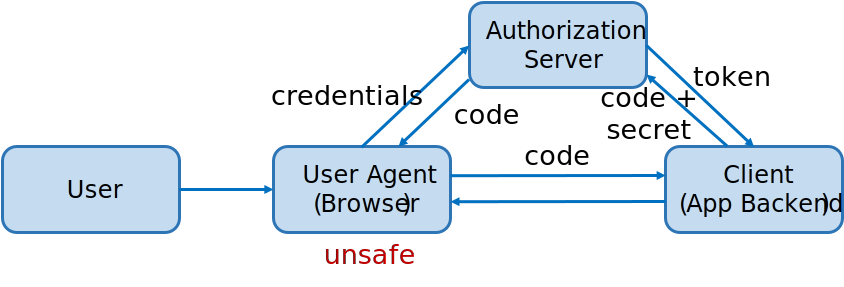

授权码(Authorization Code)模式是 OAuth2 中最广泛使用的第三方应用和部分第一方应用授权的方式。

使用授权码模式要求客户端必须能够与环境中的 User Agent(如浏览器)进行交互。它的主要流程是：

1. **客户端(Client)** 准备一个到 **授权服务器(Authorization server)** 的链接，并为用户在 **User Agent** 中打开。这个链接需要包含运行授权服务器识别并响应客户端的信息。
2. 用户(User)在授权服务器的页面中输入凭据。
3. 用户凭据通过 User Agent 发送到授权服务器。
4. **授权服务器** 校验凭证，附带一个授权码(Authorization code)，将页面重定向回 **客户端**。
5. 客户端与 **授权服务器** 通信，确认身份后使用授权码交换一个 **Access Token** ，以及可能有的 Refresh Token。
6. **客户端** 使用 Access token 在 **资源服务器(Resource Server)** 上访问所需要的资源。


除了 web 应用程序之外，移动应用的客户端也可以使用授权码模式进行授权。通常来说，web 应用程序会使用 Client ID 和 Client Secret 来标识应用，而移动应用则会使用一些其他的技术。

也许看完上面的流程你会有疑惑，授权不就是个简单的输入账号密码吗，为什么会搞这么多复杂的流程出来。这实际上是综合了信任问题、安全问题以及现有协议能力才得到的结果。

## 简单的授权流程和信任问题

为了区分各个第三方应用，授权方会为每个应用生成一个 **Client Key**。授权服务器根据第三方应用的 Client Key 和用户凭据向客户端发放 Access Token。

这时，他们之间的关系大致是： `User Credentials + Client Key -> Access Token`

在任何时刻，攻击者都不应拿到 Access Token，否则可以随意访问用户的数据。因此，最好的方法是授权服务器在用户输入凭据并校验后，直接将 Access Token 发送到应用后端。

根据以上的思路，可以设计出一个最简单的方案，它的流程大致是这样的(如下图)：

1. 用户在应用提供的页面中输入凭据。
2. 页面将用户凭据发送给应用后端。
3. 应用后端将用户凭据发送给授权服务器，授权服务器校验后将 token 返回。


这个模式会遇到一些问题：授权方始终不知道也不能控制应用对用户凭据做了什么事情，第三方应用可以将用户凭据偷偷保存到自己的数据库里，这很不安全！

因此，授权方始终不信任第三方应用。

## 理想状态

解决这个问题的方法并不难：让用户在受信任的页面中输入凭据。这时需要让第三方应用在需要用户授权的时候进入授权方提供的页面。

想象一下这个最理想的状态：

1. 应用在 User Agent 中打开授权服务器提供的页面，用户在页面中输入凭据
2. User Agent 将用户凭据发送到授权服务器
3. 授权服务器校验凭据，并将 token 直接发送给客户端
4. 客户端通知 User Agent 用户登录成功

没有中间商，看起来真的很理想！


但是，你可能忽略了一些问题：

- 依照 TCP/IP 协议，客户端主动找到 User Agent，因此无法主动向 User Agent 发送请求
- 如果要保持一个较长的连接，则需要 User Agent 先行与客户端发送一个 HTTP 请求，然后一直挂起直到客户端收到 token。但是，HTTP 的精神是无状态、用完即走、尽快返回，如果这么做并不是一个好的实践方案。
- 如果使用其他协议保持长连接，就脱离了 OAuth 的框架，也有可能遇到浏览器兼容问题

## User Agent：我只是工具人

为了解决上述问题，授权服务器必须找一条其他路径让客户端收到 Access Token，又同时能让 User Agent 有所响应。由于现在 User Agent 所处的页面是授权服务器的 Domain，这时候只能使用一些骚操作：在授权服务器校验完用户凭证后，将页面重定向回应用的 Domain 并带上用户的 Access Token。再由 User Agent 将 Access Token 发送给客户端（甚至直接在 User Agent 处使用）。


但是，这个模式并不安全：

- 重定向回应用的 Domain 并将 Access Token 发往客户端时，Access Token 很容易在 User Agent 处被攻击者截获。
- 这个过程中第三方应用的凭据（这里是 Client Key，你也可以想象其他 Case 在这个模式下是否都一样） 是被暴露在请求中的，攻击者可以轻易拿到这个凭据，并伪造别的应用请求授权。

## 更复杂，更安全

经过上文章的诸多讨论，虽然得出的几个 solution 并不完美，但是还是能摸索出一个安全又可行的流程大致需要满足的条件：

- 授权服务器必须在 User Agent 处重定向回应用的 Domain，让 User Agent 有机会响应登录事件
- Access Token 不能经过 User Agent，必须由授权服务器直接发送给客户端

结合这两个需求，可以在前一个方案上做一些改进：

- 引入一个临时验证码，让重定向回第三方应用 Domain 时带上这个验证码
- User Agent 将这个临时验证码发送给客户端，客户端凭验证码想授权按服务器换取真正的 Access Token

可以用一组大致说明各个元素之间的关系和这整个流程：

```
User Credentials + Client Key -> Authorization Code
Authorization Code + Client Key -> Access Token
```

仔细思考一下上面的表达式，这中间还有一个问题：Client Key 和 Authorization Code 都会经过 User Agent，攻击者还是可以凭它们得到 Access Token。

解决这个问题的方法也不难找到：把 Client Key 一分为二，一部分在 User Agent 打开授权页面时使用(Client ID)，另一部分只在客户端换取 Token 的时候使用(Client Secret)。现在，这个流程就变为了：

```
User Credentials + Client ID -> Authorization Code
Authorization Code + Client Secret -> Access Token
```

由于 Client Secret 只保存在客户端，User Agent 在任何时候都无法得到，攻击者也即使有 Authorization Code 和 Client ID，也无法获得 Access Token。



## 最后

实际上，文中除了 Authorization Code 模式外，另外提到的两个方案分别是 OAuth2 中的 Implicit 模式和 Client Credentials 模式。不知道是机缘巧合还是什么原因，可能我的思路正好和设计者的思路类似吧。

希望这篇文章能给你一些启发，或者带来一些思考。

## Refs

- [Understanding OAuth2 and Building a Basic Authorization Server of Your Own: A Beginner’s Guide](https://medium.com/google-cloud/understanding-oauth2-and-building-a-basic-authorization-server-of-your-own-a-beginners-guide-cf7451a16f66)
